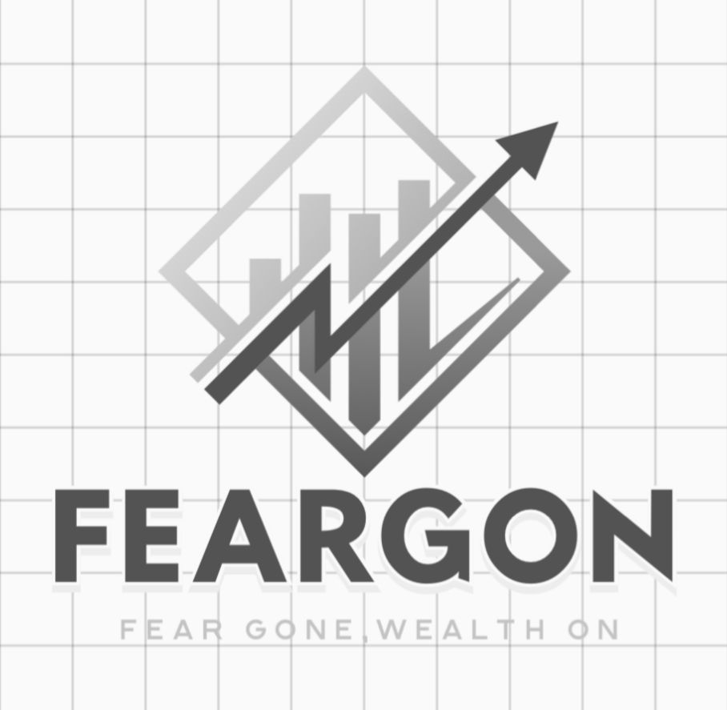

<div align="center">
  
  
  <br/>
  <h1>🚀 Fearless Invest</h1>
  <h3>Gamifying fintech to utterly remove the fear of investing for beginners.</h3>

  <p>
    <strong>A high-performance, glassmorphism SaaS empowering the next generation of financial independence.</strong>
  </p>

</div>


> **Mission**: Over 60% of millennials and Gen Z never invest because the complexity of markets terrifies them. Fearless Invest strips away the dense jargon, providing an ultra-sleek, simulation-first environment guided by a private AI advisor. We remove the panic; you print the returns.

---

## 🌟 Why Fearless Invest? (The Hackathon Vision)

In traditional apps, jumping into the stock market feels like jumping into the ocean without a lifejacket. Red cascading charts trigger anxiety, and complicated derivatives repel beginners. 

**Fearless Invest** solves this using three psychological pillars:
1. **The Sandbox (Simulator):** A risk-free portfolio environment using simulated funds on real-world, live-time API metrics.
2. **The Guide (AI Advisor):** Powered by **Google Gemini 1.5/2.5 Flash**, the embedded AI speaks human. If a stock drops 4%, the AI explains exactly *why* and prevents panic selling, enforcing an "Advisor" persona tailored to the user's predefined Risk Appetite.
3. **The Global Scope:** Instant conversion to native currencies (`USD`, `EUR`, `INR`) allowing underbanked overseas investors to calculate localized buying power.

---

## ⚙️ Tech Stack

This project was engineered for blazing speed, eliminating the overhead of bloated frontend abstractions.

### Frontend
- **Vite** - Lightning fast module bundling and HMR.
- **Vanilla JS + DOM Canvas** - Lightweight, zero-dependency ultra-smooth dynamic charts using native HTML5 Canvas drawing frameworks built entirely from scratch.
- **Native CSS** - Hand-crafted frosted glass UI elements (Glassmorphism), dynamic glowing border effects, and responsive mobile architecture.

### Backend & Cloud
- **Node.js (Express)** - A resilient backend proxy securely storing API tokens that powers the AI interface.
- **Supabase** - Live PostgreSQL database hooked to native Authentication, isolating Users with specific metadata tracking limits (Profiles table).

### Integrations Ecosystem
- **Google Generative AI (Gemini Flash)** - The brain of the personalized investment advisor.
- **CoinGecko API**  - Real-time Cryptocurrency streaming and delta mapping (BTC, ETH). 
- **Yahoo Finance API** - Live global stock ticker streams + Trending charts (AAPL, TSLA).

---

## 🚀 Core Features

- 🔐 **Serverless Auth** - Instant Signup/Login utilizing built-in Supabase session hijacking protection.
- 💬 **Gemini-Powered Chat** - An optimized, single-retry debounced Node server wrapper passing secure prompts directly to the world's most advanced LLMs.
- ⚡ **Global State Syncing** - Dropdown configurations updating application logic from dollars to Euros flawlessly across all simulated APIs.
- 📊 **Animated Canvases** - Deep SVG and Canvas native integration mimicking ultra-premium SaaS applications visually.
- ♥️ **Risk Pulse Engine** - Dynamically calculating user portfolio deltas generating a unique "Confidence Score" so users never trade blindly.

---

## 🛠️ How to Run Locally

You can spin up the full platform within 2 minutes.

### Prerequisites
- Node.js (v18+)
- Supabase Free Account (For Auth)
- Google AI Studio API Key (For Gemini)

### Installation Sequence

1. **Clone the repo**
   ```bash
   git clone https://github.com/roshandhiman/investingfear.git
   cd fearless-invest
   ```

2. **Install dependencies**
   ```bash
   npm install
   ```

3. **Configure Environment Variables**
   Copy the provided `env.example` file to create a `.env` file in the root directory. You can do this by running:
   ```bash
   cp env.example .env
   ```
   Then open `.env` and fill in your actual keys:
   ```env
   # Your Supabase Keys
   VITE_SUPABASE_URL=your_supabase_project_url
   VITE_SUPABASE_ANON_KEY=your_supabase_anon_key
   
   # Your AI key
   GEMINI_API_KEY=your_gemini_key
   ```

4. *(Optional)* **Supabase Database Prep** 
   In your Supabase SQL window, paste:
   ```sql
   create table profiles (
     id uuid references auth.users not null primary key,
     name text,
     currency text default 'USD'
   );
   ```

5. **Engage the Hyperdrive**
   ```bash
   npm run dev
   ```
   > App boots on `http://localhost:5173`. The backend strictly binds a listener for AI tokens on port `3000`.

---
## ✨ Looking Ahead

Fearless Invest represents an idealized paradigm for financial accessibility. Moving forward, the roadmap includes connecting **Plaid API** for live broker syncing, and implementing an automatic 'Buy/Sell' **AutoMode** using a fully fine-tuned proprietary generative model executing robo-trades securely.

*We didn't just build a trading app. We built financial courage.*
